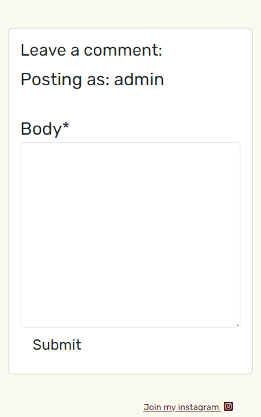

# VICTORIABAKERYBLOG

The live link can be found [here](https://victoria-bakery.herokuapp.com/)

## UX

During UX designing process of the project were conducted interview and then created personas, paper and digital wireframes, low-fidelity prototype  and mock ups  of the project. For more detailed process please see pdf file.

[UX research](https://drive.google.com/file/d/1xccCysB1zefJSmA6NpKRAZJxLUwKfMER/view?usp=sharing)

Personas

[persona1](documents/personaD.png)

[persona2](documents/personaL.png)

Journey Map

[persona1](documents/journeymapd.png)

[persona2](documents/journeymapl.png)

## Wireframes

Paper wireframe

[paperwireframe](documents/paperwiref.png)
[paperwireframe](documents/paperwirefr.png)
[paperwireframe](documents/paperwirefram.png)
[paperwireframe](documents/wireframe.png)

Low-fidelity prototype before interview

[low-fidelity prototype](documents/low_fidelity_before.png)

Low-fidelity prototype after interview

[low-fidelity prototype](documents/low_fidelity_after.png)


### Colour Scheme

Colors scheme was selected according to the logo and was used for highlights text. Background page color was selected to make text standing but not too bright. Colors were tested for colorblind and contast ratio were checked. 

[colorblind](documents/colorblind.png)
[contrast ratio](documents/contrast_ratio.png)

- `#000000` used for primary text.
- `#520808` used for primary highlights, logo text.
- `#212529` used for comments, highlights the author name.
- `33;37;41;0.75` used for comments, highlights the date.
- `250;250;241` used for background.

### Typography

Next google fonts were used.

- [Permanent Marker](https://fonts.google.com/specimen/Permanent+Marker?query=permane) was used for the primary headers and titles.

- [Rubik](https://fonts.google.com/specimen/Rubik?query=rubik) was used for all other secondary text.

- [Sigmar](https://fonts.google.com/specimen/Sigmar?query=sigmar) was used for navigation menu.

- [Dancing Script](https://fonts.google.com/specimen/Dancing+Script?query=danc) was used for sign in text.

- [Font Awesome](https://fontawesome.com) icons were used throughout the site, such as the social media icons in the footer.

## User Stories

Next user stories were planned

### New Site Users

- As a new site user, I would like to read a blog, so that I can see recipes.
- As a new site user, I would like to leave comments, so that I can participate in the blog.
- As a new site user, I would like to delete comments, so that I can manage my comments.
- As a new site user, I would like to rate a blog, so that I can pick up what's the best to cook.
- As a new site user, I would like to see a read time, so that I can pick up the quickest recipe.

### Returning Site Users

- As a returning site user, I would like to contact an admin, so that I can stay in contact.
- As a returning site user, I would like to read a new blog, so that I can see new recipes.
- As a returning site user, I would like to read comments, so that I can see if recipe is good.
- As a returning site user, I would like to log in, so that I can stay in.
- As a returning site user, I would like to like/unlike, so that I can manage my vote.

### Site Admin

- As a site administrator, I should be able to delete comment, so that I can manage a blog.
- As a site administrator, I should be able to read a post, so that I can manage a post content.
- As a site administrator, I should be able to update a post, so that I  can manage a post content.
- As a site administrator, I should be able to create a post, so that I can manage a post content.
- As a site administrator, I should be able to answer questions, so that I can stay in touch with the user.

## Features

### Existing Features

- **Sign in**

    - Sign in feature was implemented for user so they can stay in touch and leave comments. 


- **Log in/out**

    - After sign in user can log in and log out.


- **Leave a comment**

    - User can leave a comment



- **Delete a comment**

    - User can delete comments


- **Ask questions**

    - User can ask questions and stay in touch.


### Future Features

There are two features that I would like to include in future

- **Delete an account**

- **Create a chat**

## Tools & Technologies Used

In the project next tools and technologies were use:

- [HTML](https://en.wikipedia.org/wiki/HTML) used for the main site content.
- [CSS](https://en.wikipedia.org/wiki/CSS) used for the main site design and layout.
- [CSS :root variables](https://www.w3schools.com/css/css3_variables.asp) used for reusable styles throughout the site.
- [JavaScript](https://www.javascript.com) used for user interaction on the site.
- [Python](https://www.python.org) used as the back-end programming language.
- [Git](https://git-scm.com) used for version control. (`git add`, `git commit`, `git push`)
- [GitHub](https://github.com) used for secure online code storage.
- [GitHub Pages](https://pages.github.com) used for hosting the deployed front-end site.
- [Gitpod](https://gitpod.io) used as a cloud-based IDE for development.
- [Codeanywhere](https://app.codeanywhere.com) used as a cloud-based IDE for development.
- [Bootstrap](https://getbootstrap.com) used as the front-end CSS framework for modern responsiveness and pre-built components.
- [Django](https://www.djangoproject.com) used as the Python framework for the site.
- [PostgreSQL](https://www.postgresql.org) used as the relational database management.
- [ElephantSQL](https://www.elephantsql.com) used as the Postgres database.
- [Heroku](https://www.heroku.com) used for hosting the deployed back-end site.
- [Cloudinary](https://cloudinary.com) used for online static file storage.

## Database Design

Entity Relationship Diagrams (ERD) help to visualize database architecture before creating models.
Understanding the relationships between different tables can save time later in the project.

```python

class RecipePost(models.Model):
    title = models.CharField(max_length=200, unique=True)
    slug = models.SlugField(max_length=200, unique=True)
    updated_on = models.DateTimeField(auto_now=True)
    created_on = models.DateTimeField(auto_now_add=True)
    ingredients = models.TextField(blank=True)
    content = models.TextField(blank=True)
    author = models.ForeignKey(
        User, on_delete=models.CASCADE, related_name="blog_posts"
    )
    featured_image = CloudinaryField('image', default='placeholder')
    read_time = models.IntegerField(default=0)
    timestamp = models.DateTimeField(auto_now=False, auto_now_add=True)    
    status = models.IntegerField(choices=STATUS, default=0)
    hearts = models.ManyToManyField(
        User, related_name='blogpost_hearts', blank=True)
```

- Table: **RecipePost**

    | **PK** | **id** (unique) | Type | Notes |
    | --- | --- | --- | --- |
    | **FK** | author | ForeignKey | FK to **author** |
    | | title | CharField | |
    | | slug | SlugField | |
    | | updated_on | DateTimeField | |
    | | created_on | DateTimeField | |
    | | ingredients | TextField | |
    | | content | TextField | |
    | | featured_image  | CloudinaryField | |
    | | read_time | IntegerField | |
    | | timestamp | DateTimeField | |
    | | status | IntegerField | |
    | | hearts | ManyToManyField | |

## Agile Development Process

### GitHub Projects

[GitHub Projects](https://github.com/Alena18/BakeryBlog3/projects) served as an Agile tool for this project.
It isn't a specialized tool, but with the right tags and project creation/issue assignments, it can be made to work.

Through it, user stories, issues, and milestone tasks were planned, then tracked on a weekly basis using the basic Kanban board.


### GitHub Issues

[GitHub Issues](https://github.com/Alena18/BakeryBlog3/issues) served as an another Agile tool.
There, I used my own **User Story Template** to manage user stories.

- [Open Issues](https://github.com/Alena18/BakeryBlog3/issues)

    

- [Closed Issues](https://github.com/Alena18/BakeryBlog3/issues?q=is%3Aissue+is%3Aclosed)

    

### MoSCoW Prioritization

I've decomposed my Epics into stories prior to prioritizing and implementing them.
Using this approach, I was able to apply the MoSCow prioritization and labels to my user stories within the Issues tab.

- **Must Have**: guaranteed to be delivered (*max 60% of stories*)
- **Should Have**: adds significant value, but not vital (*the rest ~20% of stories*)
- **Could Have**: has small impact if left out (*20% of stories*)
- **Won't Have**: not a priority for this iteration

## Testing

For all testing, please refer to the [TESTING.md](TESTING.md) file.

## Deployment

The live deployed application can be found deployed on [Heroku](https://victoria-bakery.herokuapp.com).

### ElephantSQL Database

This project uses [ElephantSQL](https://www.elephantsql.com) for the PostgreSQL Database.

To obtain your own Postgres Database, sign-up with your GitHub account, then follow these steps:
- Click **Create New Instance** to start a new database.
- Provide a name (this is commonly the name of the project: BakeryBlog3).
- Select the **Tiny Turtle (Free)** plan.
- You can leave the **Tags** blank.
- Select the **Region** and **Data Center** closest to you.
- Once created, click on the new database name, where you can view the database URL and Password.

### Cloudinary API

This project uses the [Cloudinary API](https://cloudinary.com) to store media assets online, due to the fact that Heroku doesn't persist this type of data.

To obtain your own Cloudinary API key, create an account and log in.
- For *Primary interest*, you can choose *Programmable Media for image and video API*.
- Optional: *edit your assigned cloud name to something more memorable*.
- On your Cloudinary Dashboard, you can copy your **API Environment Variable**.
- Be sure to remove the `CLOUDINARY_URL=` as part of the API **value**; this is the **key**.

### Heroku Deployment

This project uses [Heroku](https://www.heroku.com), a platform as a service (PaaS) that enables developers to build, run, and operate applications entirely in the cloud.

Deployment steps are as follows, after account setup:

- Select **New** in the top-right corner of your Heroku Dashboard, and select **Create new app** from the dropdown menu.
- Your app name must be unique, and then choose a region closest to you (EU or USA), and finally, select **Create App**.
- From the new app **Settings**, click **Reveal Config Vars**, and set your environment variables.

| Key | Value |
| --- | --- |
| `CLOUDINARY_URL` | user's own value |
| `DATABASE_URL` | user's own value |
| `DISABLE_COLLECTSTATIC` | 1 (*this is temporary, and can be removed for the final deployment*) |
| `SECRET_KEY` | user's own value |

Heroku needs two additional files in order to deploy properly.
- requirements.txt
- Procfile

You can install this project's **requirements** (where applicable) using:
- `pip3 install -r requirements.txt`

If you have your own packages that have been installed, then the requirements file needs updated using:
- `pip3 freeze --local > requirements.txt`

The **Procfile** can be created with the following command:
- `echo web: gunicorn app_name.wsgi > Procfile`
- *replace **app_name** with the name of your primary Django app name; the folder where settings.py is located*

For Heroku deployment, follow these steps to connect your own GitHub repository to the newly created app:

Either:
- Select **Automatic Deployment** from the Heroku app.

Or:
- In the Terminal/CLI, connect to Heroku using this command: `heroku login -i`
- Set the remote for Heroku: `heroku git:remote -a app_name` (replace *app_name* with your app name)
- After performing the standard Git `add`, `commit`, and `push` to GitHub, you can now type:
	- `git push heroku main`

The project should now be connected and deployed to Heroku!

### Local Deployment

This project can be cloned or forked in order to make a local copy on your own system.

For either method, you will need to install any applicable packages found within the *requirements.txt* file.
- `pip3 install -r requirements.txt`.

You will need to create a new file called `env.py` at the root-level,
and include the same environment variables listed above from the Heroku deployment steps.

Sample `env.py` file:

```python
import os

os.environ.setdefault("CLOUDINARY_URL", "user's own value")
os.environ.setdefault("DATABASE_URL", "user's own value")
os.environ.setdefault("SECRET_KEY", "user's own value")

# local environment only (do not include these in production/deployment!)
os.environ.setdefault("DEBUG", "True")
```

Once the project is cloned or forked, in order to run it locally, you'll need to follow these steps:
- Start the Django app: `python3 manage.py runserver`
- Stop the app once it's loaded: `CTRL+C` or `⌘+C` (Mac)
- Make any necessary migrations: `python3 manage.py makemigrations`
- Migrate the data to the database: `python3 manage.py migrate`
- Create a superuser: `python3 manage.py createsuperuser`
- Load fixtures (if applicable): `python3 manage.py loaddata file-name.json` (repeat for each file)
- Everything should be ready now, so run the Django app again: `python3 manage.py runserver`

#### Cloning

You can clone the repository by following these steps:

1. Go to the [GitHub repository](https://github.com/Alena18/BakeryBlog3) 
2. Locate the Code button above the list of files and click it 
3. Select if you prefer to clone using HTTPS, SSH, or GitHub CLI and click the copy button to copy the URL to your clipboard
4. Open Git Bash or Terminal
5. Change the current working directory to the one where you want the cloned directory
6. In your IDE Terminal, type the following command to clone my repository:
	- `git clone https://github.com/Alena18/BakeryBlog3.git`
7. Press Enter to create your local clone.

Alternatively, if using Gitpod, you can click below to create your own workspace using this repository.

[](https://gitpod.io/#https://github.com/Alena18/BakeryBlog3)

Please note that in order to directly open the project in Gitpod, you need to have the browser extension installed.
A tutorial on how to do that can be found [here](https://www.gitpod.io/docs/configure/user-settings/browser-extension).

#### Forking

By forking the GitHub Repository, we make a copy of the original repository on our GitHub account to view and/or make changes without affecting the original owner's repository.
You can fork this repository by using the following steps:

1. Log in to GitHub and locate the [GitHub Repository](https://github.com/Alena18/BakeryBlog3)
2. At the top of the Repository (not top of page) just above the "Settings" Button on the menu, locate the "Fork" Button.
3. Once clicked, you should now have a copy of the original repository in your own GitHub account!

## Credits

During the project next additional media were used:

| Source | Location | Notes |
| --- | --- | --- |
| [Markdown Builder](https://traveltimn.github.io/markdown-builder) | README and TESTING | tool to help generate the Markdown files |
| [ChatGPT](https://openai.com/blog/chatgpt) | django | "How to Use Django" |
| [StackOverflow](https://stackoverflow.com/questions/448919/how-can-i-remove-a-commit-on-github) | Remove commits | How to remove last commit in github |
| [YouTube](https://www.youtube.com/watch?v=8NPOwmtupiI&t=473s) | Delete comments | Delete comments Django Python |
| [YouTube](https://www.youtube.com/watch?v=vIv1c6RLBac) | PP4 | tutorial for the beginning of the project |

### Acknowledgements

- I would like to thank my Code Institute mentor, [Tim Nelson](https://github.com/TravelTimN) for his huge support throughout the development of this project.
- I would like to thank the [Code Institute](https://codeinstitute.net) tutor team for their assistance with troubleshooting and debugging some project issues.
- I would like to thank the [Code Institute Slack community](https://code-institute-room.slack.com) for the moral support; it kept me going during periods of self doubt and imposter syndrome.

