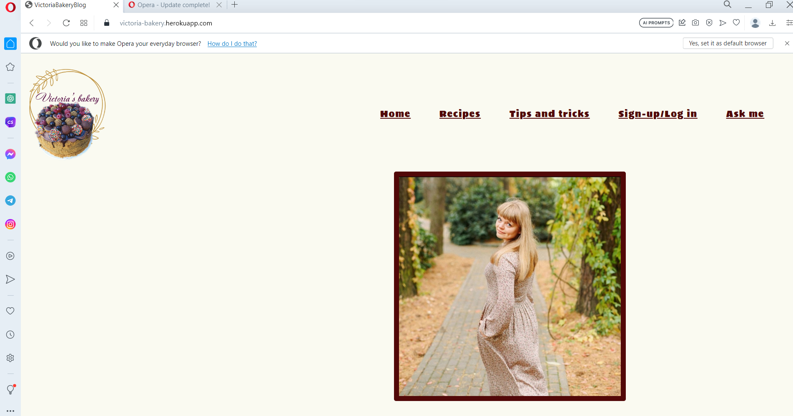
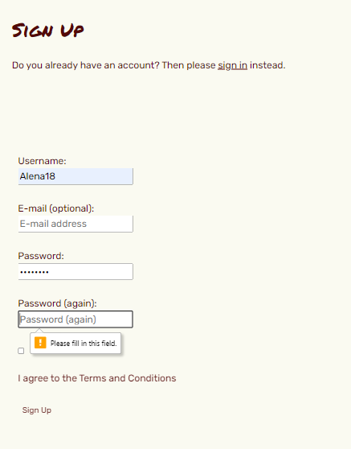

# Testing

Return back to the [README.md](README.md) file.

## Code Validation

### HTML

I have used the recommended [HTML W3C Validator](https://validator.w3.org) to validate all of my HTML files.

| Page | W3C URL | Screenshot | Notes |
| --- | --- | --- | --- |
| Home | [W3C](https://validator.w3.org/nu/?doc=https%3A%2F%2Fvictoria-bakery.herokuapp.com%2Findex.html) |  | Section lacks header h2-h6 warning |
| Blog | [W3C](https://validator.w3.org/nu/?doc=https%3A%2F%2Fvictoria-bakery.herokuapp.com%2Frecipes.html) |  | Trailing slash on void elements warning |
| Tips | [W3C](https://validator.w3.org/nu/?doc=https%3A%2F%2Fvictoria-bakery.herokuapp.com%2Ftips.html) |  | Trailing slash on void elements warning |
| Sign up | [W3C](https://validator.w3.org/nu/?doc=https%3A%2F%2Fvictoria-bakery.herokuapp.com%2Fsign_up.html) |  | Duplicate 'sign-up-word' |
| Log out | [W3C](https://validator.w3.org/nu/?doc=https%3A%2F%2Fvictoria-bakery.herokuapp.com%2Faccounts%2Flogout%2F) |  | Trailing slash on void elements warning |
| Ask me | [W3C](https://validator.w3.org/nu/?doc=https%3A%2F%2Fvictoria-bakery.herokuapp.com%2Fconnect.html) |  | Trailing slash on void elements warning |
| Application | [W3C](https://validator.w3.org/nu/?doc=https%3A%2F%2Fvictoria-bakery.herokuapp.com) |  | Trailing slash on void elements warning |

### CSS

I have used the recommended [CSS Jigsaw Validator](https://jigsaw.w3.org/css-validator) to validate all of my CSS files.

| File | Jigsaw URL | Screenshot | Notes |
| --- | --- | --- | --- |
| style.css | [Jigsaw](https://jigsaw.w3.org/css-validator/#validate_by_uri) |  | Pass: No Errors |

### Python

I have used the recommended [PEP8 CI Python Linter](https://pep8ci.herokuapp.com) to validate all of my Python files.

| File | Screenshot | Pass | Screenshot Debug |
| --- | --- | --- | --- |
| manage.py |  | Pass: No Errors |
| settings.py |  | Errors |  |
| Blog views.py |  | Errors |  |
| urls.py |  | Pass: No Errors |
| Blog urls.py |  | Pass: No Errors |
| Blog models.py |  | Errors |  |
| apps.py |  | Pass: No Errors |
| wsgi.py |  | Pass: No Errors |
| forms.py |  | Pass: No Errors |
| admin.py |  | Pass: No Errors |

## Browser Compatibility

I've tested my deployed project on multiple browsers to check for compatibility issues.

| Browser | Screenshot | Notes |
| --- | --- | --- |
| Chrome |  | Works as expected |
| Firefox |  | Works as expected |
| Edge |  | Works as expected |
| Brave |  | Works as expected |
| Opera |  | Works as expected |

## Responsiveness

## Lighthouse Audit

I've tested my deployed project on multiple devices to check for responsiveness issues.

| Device | Screenshot | Notes |
| --- | --- | --- |
| Mobile (DevTools) |  | Works as expected |
| Tablet (DevTools) |  | Works as expected |
| Desktop |  | Works as expected |

## Defensive Programming

Defensive programming was manually tested with the below user acceptance testing:

| Page | User Action | Expected Result | Pass/Fail | Comments |
| --- | --- | --- | --- | --- |
| Home Page | | | | |
| | Click on Logo | Redirection to Home page | Pass | |
| | Click on Home link in navbar | Redirection to Home page | Pass | |
| Gallery Page | | | | |
| | Click on Gallery link in navbar | Redirection to Gallery page | Pass | |
| Contact Page | | | | |
| | Click on Contact link in navbar | Redirection to Contact page | Pass | |
| | Enter first name ask page | Field will accept freeform text | Pass |  |
| | Enter valid email address ask page | Field will only accept email address format | Pass |  |
| | Enter message in textarea | Field will accept freeform text | Pass |  |
| | Click the Submit button | Redirects user to form-dump | Pass | User must click 'Back' button to return, email sent to admin |
| Sign Up | | | | |
| | Click on Sign Up button | Redirection to Sign Up page | Pass | |
| | Enter name | Field will accept freeform text | Pass |  |
| | Enter valid password (twice) | Field will only accept password format | Pass |  |
| | Enter valid password (twice) | Field will only accept password format | Pass |  |
| | Tick to accept terms | Must tick | Pass |  |
| Log In | | | | |
| | Click on the Login link | Redirection to Login page | Pass | |
| | Enter valid name | Field will accept freeform text | Pass | |
| | Enter valid password | Field will only accept password format | Pass | |
| | Click Login button | Redirects user to home page | Pass | |
| Log Out | | | | |
| | Click Logout button | Redirects user to logout page | Pass | Confirms logout first |
| | Click Confirm Logout button | Redirects user to home page | Pass | |
| Profile | | | | |
| | Click on Profile button | User will be redirected to the Profile page | Pass | |

## User Story Testing

| User Story | Screenshot |
| --- | --- |
| As a new site user, I would like to read a blog, so that I can see recipes. |  |
| As a new site user, I would like to leave comments, so that I can participate in the blog. |  |
| As a new site user, I would like to delete comments, so that I can manage my comments. |  |
| As a new site user, I would like to rate a blog, so that I can pick up what's the best to cook. |  |
| As a new site user, I would like to see a read time, so that I can pick up the quickest recipe. |  |
| As a returning site user, I would like to contact an admin, so that I can stay in contact. |  |
| As a returning site user, I would like to read a new blog, so that I can see new recipes. |  |
| As a returning site user, I would like to read comments, so that I can see if recipe is good. |  |
| As a returning site user, I would like to log in, so that I can stay in. |  |
| As a returning site user, I would like to like/unlike, so that I can manage my vote. |  |
| As a site administrator, I should be able to delete comment, so that I can manage a blog. |  |
| As a site administrator, I should be able to read a post, so that I can manage a post content. |  |
|As a site administrator, I should be able to update a post, so that I  can manage a post content. |  |
| As a site administrator, I should be able to create a post, so that I can manage a post content. |  |
|As a site administrator, I should be able to answer questions, so that I can stay in touch with the user. |  |

## Bugs

**Fixed Bugs**

All previously closed/fixed bugs can be tracked [here](https://github.com/Alena18/BakeryBlog3/issues?q=is%3Aissue+is%3Aclosed).

| Bug | Status |
| --- | --- |
| [Heroku App](documents/apptail.png) | Closed |

| How it was fixed | Screenshot |
| --- | --- |
| Use Terminal |  [screenshot](documents/debugone.png) |
| Use Terminal |  [screenshot](documents/debugtwo.png) |
| Procfile |  [screenshot](documents/debugthree.png) |
| Solved |  [screenshot](documents/work.png) |

**Open Issues**

Any remaining open issues can be tracked [here](https://github.com/Alena18/BakeryBlog3/issues).

## Unfixed Bugs

There are no remaining bugs that I am aware of.
