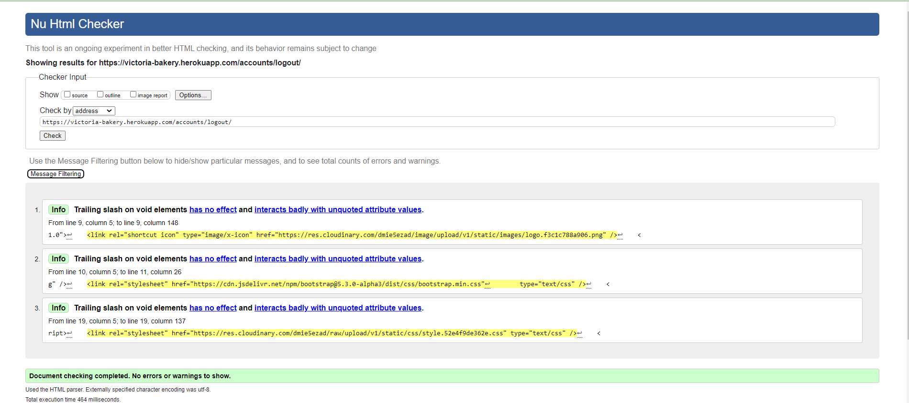

# Testing

Return back to the [README.md](README.md) file.

## Code Validation

### HTML

I have used the recommended [HTML W3C Validator](https://validator.w3.org) to validate all of my HTML files.

| Page | W3C URL | Screenshot | Notes |
| --- | --- | --- | --- |
| Home | [W3C](https://validator.w3.org/nu/?doc=https%3A%2F%2Fvictoria-bakery.herokuapp.com%2Findex.html) |  | Section lacks header h2-h6 warning |
| Blog | [W3C](https://validator.w3.org/nu/?doc=https%3A%2F%2Fvictoria-bakery.herokuapp.com%2Frecipes.html) |  | Trailing slash on void elements warning |
| Tips | [W3C](https://validator.w3.org/nu/?doc=https%3A%2F%2Fvictoria-bakery.herokuapp.com%2Ftips.html) |  | Trailing slash on void elements warning |
| Sign up | [W3C](https://validator.w3.org/nu/?doc=https%3A%2F%2Fvictoria-bakery.herokuapp.com%2Fsign_up.html) |  | Duplicate 'sign-up-word' |
| Log out | [W3C](https://validator.w3.org/nu/?doc=https%3A%2F%2Fvictoria-bakery.herokuapp.com%2Faccounts%2Flogout%2F) |  | Trailing slash on void elements warning |
| Ask me | [W3C](https://validator.w3.org/nu/?doc=https%3A%2F%2Fvictoria-bakery.herokuapp.com%2Fconnect.html) |  | Trailing slash on void elements warning |
| Application | [W3C](https://validator.w3.org/nu/?doc=https%3A%2F%2Fvictoria-bakery.herokuapp.com) |  | Trailing slash on void elements warning |

### CSS

I have used the recommended [CSS Jigsaw Validator](https://jigsaw.w3.org/css-validator) to validate all of my CSS files.

| File | Jigsaw URL | Screenshot | Notes |
| --- | --- | --- | --- |
| style.css | [Jigsaw](https://jigsaw.w3.org/css-validator/#validate_by_uri) |  | Pass: No Errors |

### Python

I have used the recommended [PEP8 CI Python Linter](https://pep8ci.herokuapp.com) to validate all of my Python files.

| File | Screenshot | Pass | Screenshot Debug |
| --- | --- | --- | --- |
| manage.py |  | Pass: No Errors |
| settings.py |  | Errors |  |
| Blog views.py |  | Errors |  |
| urls.py |  | Pass: No Errors |
| Blog urls.py |  | Pass: No Errors |
| Blog models.py |  | Errors |  |
| apps.py |  | Pass: No Errors |
| wsgi.py |  | Pass: No Errors |
| forms.py |  | Pass: No Errors |
| admin.py |  | Pass: No Errors |

## Browser Compatibility

I've tested my deployed project on multiple browsers to check for compatibility issues.

| Browser | Screenshot | Notes |
| --- | --- | --- |
| Chrome |  | Works as expected |
| Firefox |  | Works as expected |
| Edge |  | Works as expected |
| Brave |  | Works as expected |
| Opera |  | Works as expected |

## Responsiveness

## Lighthouse Audit

I've tested my deployed project on multiple devices to check for responsiveness issues.

| Device | Screenshot | Notes |
| --- | --- | --- |
| Mobile (DevTools) |  | Works as expected |
| Tablet (DevTools) |  | Works as expected |
| Desktop |  | Works as expected |

## Defensive Programming

Defensive programming was manually tested with the below user acceptance testing:

| Page | User Action | Expected Result | Pass/Fail | Comments |
| --- | --- | --- | --- | --- |
| Home Page | | | | |
| | Click on Logo | Redirection to Home page | Pass | |
| | Click on Home link in navbar | Redirection to Home page | Pass | |
| Gallery Page | | | | |
| | Click on Gallery link in navbar | Redirection to Gallery page | Pass | |
| Contact Page | | | | |
| | Click on Contact link in navbar | Redirection to Contact page | Pass | |
| | Enter first name ask page | Field will accept freeform text | Pass |  |
| | Enter valid email address ask page | Field will only accept email address format | Pass |  |
| | Enter message in textarea | Field will accept freeform text | Pass |  |
| | Click the Submit button | Redirects user to form-dump | Pass | User must click 'Back' button to return, email sent to admin |
| Sign Up | | | | |
| | Click on Sign Up button | Redirection to Sign Up page | Pass | |
| | Enter name | Field will accept freeform text | Pass |  |
| | Enter valid password (twice) | Field will only accept password format | Pass |  |
| | Enter valid password (twice) | Field will only accept password format | Pass |  |
| | Tick to accept terms | Must tick | Pass |  |
| Log In | | | | |
| | Click on the Login link | Redirection to Login page | Pass | |
| | Enter valid name | Field will accept freeform text | Pass | |
| | Enter valid password | Field will only accept password format | Pass | |
| | Click Login button | Redirects user to home page | Pass | |
| Log Out | | | | |
| | Click Logout button | Redirects user to logout page | Pass | Confirms logout first |
| | Click Confirm Logout button | Redirects user to home page | Pass | |
| Profile | | | | |
| | Click on Profile button | User will be redirected to the Profile page | Pass | |

## User Story Testing

| User Story | Screenshot |
| --- | --- |
| As a new site user, I would like to read a blog, so that I can see recipes. |  |
| As a new site user, I would like to leave comments, so that I can participate in the blog. |  |
| As a new site user, I would like to delete comments, so that I can manage my comments. |  |
| As a new site user, I would like to rate a blog, so that I can pick up what's the best to cook. |  |
| As a new site user, I would like to see a read time, so that I can pick up the quickest recipe. |  |
| As a returning site user, I would like to contact an admin, so that I can stay in contact. |  |
| As a returning site user, I would like to read a new blog, so that I can see new recipes. |  |
| As a returning site user, I would like to read comments, so that I can see if recipe is good. |  |
| As a returning site user, I would like to log in, so that I can stay in. |  |
| As a returning site user, I would like to like/unlike, so that I can manage my vote. |  |
| As a site administrator, I should be able to delete comment, so that I can manage a blog. |  |
| As a site administrator, I should be able to read a post, so that I can manage a post content. |  |
|As a site administrator, I should be able to update a post, so that I  can manage a post content. |  |
| As a site administrator, I should be able to create a post, so that I can manage a post content. |  |
|As a site administrator, I should be able to answer questions, so that I can stay in touch with the user. |  |

## Automated Testing

I have conducted a series of automated tests on my application.

I fully acknowledge and understand that, in a real-world scenario, an extensive set of additional tests would be more comprehensive.

### Python (Unit Testing)

⚠️⚠️⚠️⚠️⚠️ START OF NOTES (to be deleted) ⚠️⚠️⚠️⚠️⚠️

Adjust the code below (file names, etc.) to match your own project files/folders.

🛑🛑🛑🛑🛑 END OF NOTES (to be deleted) 🛑🛑🛑🛑🛑

I have used Django's built-in unit testing framework to test the application functionality.

In order to run the tests, I ran the following command in the terminal each time:

`python3 manage.py test name-of-app `

To create the coverage report, I would then run the following commands:

`coverage run --source=name-of-app manage.py test`

`coverage report`

To see the HTML version of the reports, and find out whether some pieces of code were missing, I ran the following commands:

`coverage html`

`python3 -m http.server`

Below are the results from the various apps on my application that I've tested:

| App | File | Coverage | Screenshot |
| --- | --- | --- | --- |
| Bag | test_forms.py | 99% |  |
| Bag | test_models.py | 89% |  |
| Bag | test_urls.py | 100% |  |
| Bag | test_views.py | 71% |  |
| Checkout | test_forms.py | 99% |  |
| Checkout | test_models.py | 89% |  |
| Checkout | test_urls.py | 100% |  |
| Checkout | test_views.py | 71% |  |
| Home | test_forms.py | 99% |  |
| Home | test_models.py | 89% |  |
| Home | test_urls.py | 100% |  |
| Home | test_views.py | 71% |  |
| Products | test_forms.py | 99% |  |
| Products | test_models.py | 89% |  |
| Products | test_urls.py | 100% |  |
| Products | test_views.py | 71% |  |
| Profiles | test_forms.py | 99% |  |
| Profiles | test_models.py | 89% |  |
| Profiles | test_urls.py | 100% |  |
| Profiles | test_views.py | 71% |  |
| x | x | x | repeat for all remaining tested apps/files |

#### Unit Test Issues

⚠️⚠️⚠️⚠️⚠️ START OF NOTES (to be deleted) ⚠️⚠️⚠️⚠️⚠️

Use this section to list any known issues you ran into while writing your unit tests.
Remember to include screenshots (where possible), and a solution to the issue (if known).

This can be used for both "fixed" and "unresolved" issues.

🛑🛑🛑🛑🛑 END OF NOTES (to be deleted) 🛑🛑🛑🛑🛑

## Bugs

⚠️⚠️⚠️⚠️⚠️ START OF NOTES (to be deleted) ⚠️⚠️⚠️⚠️⚠️

It's very important to document any bugs you've discovered while developing the project.
Make sure to include any necessary steps you've implemented to fix the bug(s) as well.

For JavaScript and Python applications, it's best to screenshot the errors to include them as well.

**PRO TIP**: screenshots of bugs are extremely helpful, and go a long way!

🛑🛑🛑🛑🛑 END OF NOTES (to be deleted) 🛑🛑🛑🛑🛑

- JS Uncaught ReferenceError: `foobar` is undefined/not defined

    

    - To fix this, I _____________________.

- JS `'let'` or `'const'` or `'template literal syntax'` or `'arrow function syntax (=>)'` is available in ES6 (use `'esversion: 11'`) or Mozilla JS extensions (use moz).

    

    - To fix this, I _____________________.

- Python `'ModuleNotFoundError'` when trying to import module from imported package

    

    - To fix this, I _____________________.

- Django `TemplateDoesNotExist` at /appname/path appname/template_name.html

    

    - To fix this, I _____________________.

- Python `E501 line too long` (93 > 79 characters)

    

    - To fix this, I _____________________.

### GitHub **Issues**

⚠️⚠️⚠️⚠️⚠️ START OF NOTES (to be deleted) ⚠️⚠️⚠️⚠️⚠️

An improved way to manage bugs is to use the built-in **Issues** tracker on your GitHub repository.
To access your Issues, click on the "Issues" tab at the top of your repository.
Alternatively, use this link: https://github.com/Alena18/BakeryBlog3/issues

If using the Issues tracker for your bug management, you can simplify the documentation process.
Issues allow you to directly paste screenshots into the issue without having to first save the screenshot locally,
then uploading into your project.

You can add labels to your issues (`bug`), assign yourself as the owner, and add comments/updates as you progress with fixing the issue(s).

Once you've sorted the issue, you should then "Close" it.

When showcasing your bug tracking for assessment, you can use the following format:

🛑🛑🛑🛑🛑 END OF NOTES (to be deleted) 🛑🛑🛑🛑🛑

**Fixed Bugs**

All previously closed/fixed bugs can be tracked [here](https://github.com/Alena18/BakeryBlog3/issues?q=is%3Aissue+is%3Aclosed).

| Bug | Status |
| --- | --- |
| [JS Uncaught ReferenceError: `foobar` is undefined/not defined](https://github.com/Alena18/BakeryBlog3/issues/1) | Closed |
| [Python `'ModuleNotFoundError'` when trying to import module from imported package](https://github.com/Alena18/BakeryBlog3/issues/2) | Closed |
| [Django `TemplateDoesNotExist` at /appname/path appname/template_name.html](https://github.com/Alena18/BakeryBlog3/issues/3) | Closed |

**Open Issues**

Any remaining open issues can be tracked [here](https://github.com/Alena18/BakeryBlog3/issues).

| Bug | Status |
| --- | --- |
| [JS `'let'` or `'const'` or `'template literal syntax'` or `'arrow function syntax (=>)'` is available in ES6 (use `'esversion: 11'`) or Mozilla JS extensions (use moz).](https://github.com/Alena18/BakeryBlog3/issues/4) | Open |
| [Python `E501 line too long` (93 > 79 characters)](https://github.com/Alena18/BakeryBlog3/issues/5) | Open |

## Unfixed Bugs

⚠️⚠️⚠️⚠️⚠️ START OF NOTES (to be deleted) ⚠️⚠️⚠️⚠️⚠️

You will need to mention unfixed bugs and why they were not fixed.
This section should include shortcomings of the frameworks or technologies used.
Although time can be a big variable to consider, paucity of time and difficulty understanding
implementation is not a valid reason to leave bugs unfixed.

If you've identified any unfixed bugs, no matter how small, be sure to list them here.
It's better to be honest and list them, because if it's not documented and an assessor finds the issue,
they need to know whether or not you're aware of them as well, and why you've not corrected/fixed them.

Some examples:

🛑🛑🛑🛑🛑 END OF NOTES (to be deleted) 🛑🛑🛑🛑🛑

- On devices smaller than 375px, the page starts to have `overflow-x` scrolling.

    

    - Attempted fix: I tried to add additional media queries to handle this, but things started becoming too small to read.

- For PP3, when using a helper `clear()` function, any text above the height of the terminal does not clear, and remains when you scroll up.

    

    - Attempted fix: I tried to adjust the terminal size, but it only resizes the actual terminal, not the allowable area for text.

- When validating HTML with a semantic `section` element, the validator warns about lacking a header `h2-h6`. This is acceptable.

    

    - Attempted fix: this is a known warning and acceptable, and my section doesn't require a header since it's dynamically added via JS.

⚠️⚠️⚠️⚠️⚠️ START OF NOTES (to be deleted) ⚠️⚠️⚠️⚠️⚠️

If you legitimately cannot find any unfixed bugs or warnings, then use the following sentence:

🛑🛑🛑🛑🛑 END OF NOTES (to be deleted) 🛑🛑🛑🛑🛑

There are no remaining bugs that I am aware of.
